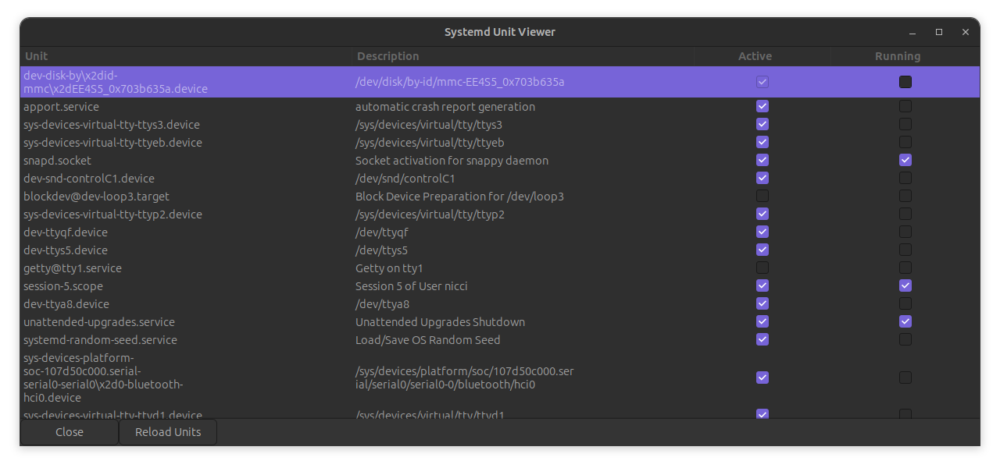

# sview - The Linux Systemd Unit Viewer

## Description
This program loads a list of systemd services and displays them with check boxes for "Active" and "Running". Toggling these checkboxes will trigger systemd commands to enable or disable the unit, or start or stop the unit. To accomplish this a policykit policy is used along with a helper than performs the job that we want to use. 

Units can be filtered so that only matches are shown, or mateches are not shown. Units can be searched with forward and backward searching. 

## Warning

I know very little about systemd but I'm learning. I have, for many years, wished for a way to control systemd securely and visually. 

I wrotet this yesterday, while watching TV. This should be considered ALPHA code, and should be treated as such. 

## Installation
To use sview, the follwing python modules are required: 

|Module   |Installation Candidate|
|---------|----------------------|
|    gi   | pygobject, cairo     |
| pystemd | python3-pystemd      |

If these modules are not installed, check your distributions installation instructions.

### setup.sh
The script, setup.sh, must be run as root. It will install the program, policy file, polkit helper and the desktop menu file. 

## Files 

| File                     | Purpose                                        |
|--------------------------|------------------------------------------------|
|sview                     | Main program module                            |
|setup.sh                  | program setup, run as root                     |
|sview.desktop             | opendesktop.org desktop entry file             |
|testmod                   | Python module to test imports, used by setup.sh|
|screenshot.png            | Screenshot of app                              |
|10-systemctl-polkit.rules | Rules for systemctl in polkit                  |
|com.ducksfeet.sview.policy| Policy for policykit                           |
|license.txt               | License for using this software                |

## Bugs 
probably a lot. 

## Documentation
This is it, sadly.
